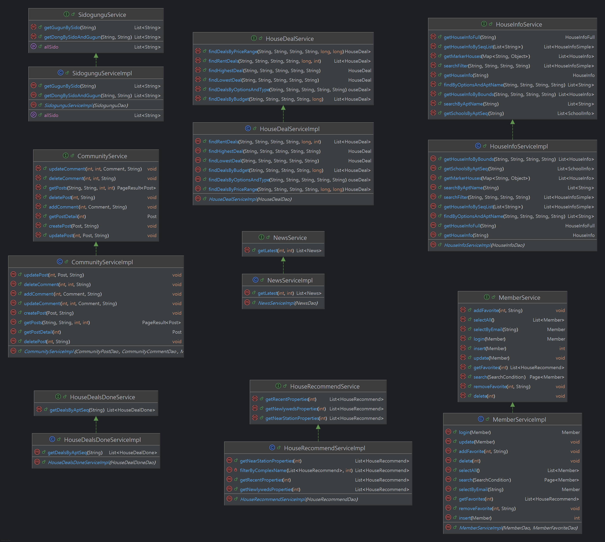

# 관통 프로젝트 집콕(ZIPKOK)


- 발음이 쉽고 친근한 느낌.
- 원하는 집을 정확히 '콕' 찍어준다는 이미지.
- 브랜드로서 확장성과 기억하기 좋은 캐릭터성 보유.

## 📌 **1. 서비스 개요**

사용자가 희망하는 지역과 예산을 입력하면, 해당 조건 내에서 부동산 실거래가 데이터를 활용하여 맞춤형 아파트 추천 리스트를 제공합니다.

---

## 📌 **2. 서비스 흐름도**

1. [사용자]

   ├─ 지역 필터 입력
   
   ├─ 로그인/회원가입
   
   ├─ 관심 매물 저장/조회
   
   └─ 서비스 사용법 문의 (AI 챗봇)
   
3. [View.js 프론트엔드]

   ├─ 사용자 입력 → REST API 요청
   
   ├─ 관심 매물 등록, 삭제 기능 제공
   
   ├─ 지도 표시 (KakaoMap 연동)
   
   └─ 챗봇 인터페이스 구성 (OpenAI API 연동)
   
5. [Spring Boot 백엔드]

   ├─ 사용자 요청 처리 (Controller + Service)
   
   ├─ 로그인/회원 인증 (Spring Security)
   
   ├─ 추천 로직 실행 (예산 + 지역 + 필터 기반)
   
   ├─ 인기 매물 판별 (크롤링 데이터 활용)
   
   ├─ 관심 아파트 저장/조회 처리
   
   └─ 챗봇 요청 전달 → AI 챗봇 서비스 호출
   
7. [MyBatis + MySQL]
   
   ├─ 국토교통부 실거래가 기반 아파트 데이터 저장
   
   ├─ 아파트 정보 크롤링 데이터 반영
   
   ├─ 사용자 정보/관심목록 저장
   
   └─ 예산 조건에 맞는 매물 필터링 쿼리 수행
   
9. [API 및 크롤링 모듈]
    
   ├─ 네이버 부동산 정보 db에 저장
   
   ├─ 네이버 뉴스 API로 부동산 뉴스 db에 저장
   
   ├─ 주 1회 Batch Job으로 스케줄링 실행
   
   └─ MySQL DB에 주기적 업데이트 반영
   
11. [챗봇 서비스]
    
   ├─ OpenAI API 기반 챗봇 서버 연동
   
   ├─ 사용자 Q&A 응대 (사용법, 검색 안내 등)
   
   └─ 요청 결과를 View.js에 전달

### 2-1. 전체 서비스 흐름

#### 2-1-1. 사용자 진입 및 인증

1. 사용자 서비스 접속
2. 로그인 상태 확인
   - 비로그인: 제한된 기능으로 메인 페이지 접근
   - 로그인: 전체 기능 이용 가능
3. 회원가입/로그인 프로세스
   - 이메일, 비밀번호 입력
   - 서버 인증 처리
   - JWT 토큰 발급 및 저장
   - 사용자 프로필 정보 로드

#### 2-1-2. 메인 기능 흐름

1. 메인 페이지(5가지 주요 기능 분기)
   - 지도 기반 매물 탐색
   - AI 챗봇 상담
   - 추천 매물 확인
   - 커뮤니티 참여
   - 마이페이지 관리

### 2-2. 지도 기반 매물 탐색 흐름

#### 2-2-1. 매물 검색 프로세스

1. 지도 초기화 (카카오맵 API)
2. 사용자 현재 위치 획득 (Geolocation API)
3. 기본 매물 마커 표시 (API 호출)
4. 즐겨찾기 매물 마커 표시 (로그인 시)
5. 지역별/조건별 필터링 옵션 제공
6. 검색 결과 지도에 실시간 반영

#### 2-2-2. 매물 상세 정보 흐름

1. 매물 마커 클릭
2. 사이드바 슬라이드 애니메이션으로 열림
3. 매물 상세 정보 API 호출
   
   ├─ 기본 정보 (가격, 면적, 위치, 건물 정보)
   
   ├─ 거래 내역 그래프 (Chart.js)
   
   ├─ 주변 학교 정보
   
   └─ 즐겨찾기 추가/삭제 토글 버튼
   
5. 사용자 인터랙션 처리
   
   ├─ 즐겨찾기 추가/삭제
   
   ├─ AI 챗봇으로 문의하기
   
   └─ 상세 페이지로 이동

### 2-3. AI 챗봇 상담 흐름

#### 2-3-1. 대화 처리 프로세스

1. 사용자 질문 입력
2. 자연어 처리 및 의도 분석
3. 질문 유형별 분기 처리
   1. 매물 검색 요청
      1. 검색 조건 추출
      2. 매물 데이터베이스 쿼리
      3. 검색 결과 반환
      4. 지도에 결과 표시
   2. 시장 정보 요청
      1. 최신 시장 데이터 조회
      2. 트렌드 분석
      3. 시장 동향 정보 제공
   3. 일반 질문
      1. 부동산 관련 일반 정보 제공
4. AI 응답 생성 및 전달
5. 관련 추천 질문 제시

#### 2-3-2. 도구 연동 흐름

AI 챗봇 ↔ 현재 매물 검색 도구, 거래된 매물 분석 도구, 시장 분석 도구

### 2-4. 추천 매물 시스템 흐름

#### 2-4-1. 추천 알고리즘 처리

1. 추천 카테고리별 처리
   1. 최근 거래 매물
      1. 최근 3개월 거래 데이터 기반
      2. 거래량 및 가격 변동 고려
   2. 역세권 매물
      1. 지하철역 반경 500m 이내
      2. 교통 접근성 점수 기반
   3. 신혼 추천 매물
      1. 소형 평수 (60㎡ 이하)
      2. 학군 및 생활 인프라 고려
2. 개인화 점수 계산
3. 추천 매물 리스트 생성

### 2-5. 커뮤니티 기능 흐름

#### 2-5-1. 게시판 운영 흐름

1. 커뮤니티 진입
2. 카테고리 선택
   
   ├─ 투자 정보
   
   ├─ 매물 리뷰
   
   ├─ 질문/답변
   
   ├─ 지역 정보
   
   └─ 자유 게시판
   
4. 게시글 관련 액션
   
   ├─ 게시글 작성
   
   │ ├─ 로그인 상태 확인
   
   │ ├─ 카테고리 선택
   
   │ ├─ 제목/내용 입력 (마크다운 지원)
   
   │ └─ 게시글 등록 → 목록으로 리다이렉트
   
   ├─ 게시글 조회
   
   │ ├─ 페이지네이션 (5개씩)
   
   │ ├─ 검색 기능 (제목+내용)
   
   │ ├─ 조회수 자동 증가
   
   │ └─ 상세 모달로 내용 표시
   
   ├─ 게시글 수정/삭제
   
   │ ├─ 작성자 권한 체크 (userStore.profile.mno === post.authorId)
   
   │ ├─ 수정: 기존 내용 로드 → 폼 표시 → 저장
   
   │ └─ 삭제: 확인 다이얼로그 → 삭제 → 목록 새로고침
   
   └─ 댓글 시스템
   
   ├─ 댓글 작성 (로그인 사용자만)
   
   ├─ 실시간 댓글 목록 표시
   
   ├─ 댓글 수정 (인라인 편집)
   
   └─ 댓글 삭제 (작성자만)

### 2-6. 마이페이지 관리 흐름

#### 2-6-1. 개인정보 관리

1. 마이페이지 진입
2. 탭별 기능 분기
   
   ├─ 회원정보 수정
   
   │ ├─ 현재 비밀번호 확인
   
   │ ├─ 새 정보 입력 (이름, 비밀번호, 확인 비밀번호)
   
   │ ├─ 클라이언트 유효성 검사
   
   │ ├─ 서버 검증 및 업데이트
   
   │ └─ 성공/실패 토스트 알림
   
   └─ 즐겨찾기 관리
   
   ├─ 즐겨찾기 목록 조회 (페이지네이션)
   
   ├─ 매물 썸네일 및 기본 정보 표시
   
   ├─ 즐겨찾기 삭제 (하트 아이콘 토글)
   
   └─ 해당 매물 지도로 이동 기능
   

### 2-7. 데이터 처리 및 AI 분석 흐름

#### 2-7-1 데이터 수집 프로세스

1. 외부 데이터 소스
   - 부동산 거래 데이터 API
   - 뉴스 데이터 API
   - 시장 동향 데이터
2. 데이터 수집 스케줄러
   - 정기적 데이터 수집 (일/주/월 단위)
   - 데이터 정제 및 검증
   - 데이터베이스 저장

#### 2-7-2. 실시간 데이터 처리

사용자 요청 -> API 서버 -> 캐시 저장 (Redis)
-> 캐시 확인 -> 데이터베이스 조회 -> AI 분석 -> 결과 반환

### 2-8. 시스템 아키텍처 흐름

#### 2-8-1. 프론트엔드 구조

Vue.js 애플리케이션

├── 라우터 (Vue Router)

├── 상태 관리 (Pinia)

├── 컴포넌트 구조

│ ├── 지도 컴포넌트 (Kakao Maps)

│ ├── 챗봇 인터페이스

│ ├── 매물 상세 정보

│ ├── 커뮤니티 게시판

│ └── 마이페이지

└── API 통신 (Axios)

#### 2-8-2. 백엔드 구조

Spring Boot API 서버

├── 인증/권한 관리 (JWT)

├── 매물 검색 API

├── AI 상담 API

├── 커뮤니티 API

├── 사용자 관리 API

├── 스케줄러 모듈

└── 데이터 처리 서비스


#### 2-8-3. 데이터베이스 구조

MySQL (주 데이터베이스)

├── 사용자 테이블

├── 즐겨찾기 테이블

├── 시도시군구읍면동리 정보 테이블

├── 주택정보 테이블

├── 매물 정보 테이블(네이버 크롤링)

├── 네이버 뉴스 테이블(네이버 API)

├── 학교 정보 테이블

├── 거래 내역 테이블(국토교통부 실거래가 정보)

└── 커뮤니티 테이블(게시글 댓글 카테고리)

### 2-9. 사용자 여정 (User Journey)

#### 2-9-1. 신규 사용자 여정

→ 1. 서비스 발견 → 2. 회원가입 → 3. 첫 로그인 → 4. 기능 탐색
→ 5. 매물 검색 → 6. AI 상담 이용 → 7. 즐겨찾기 등록 → 8. 상세 분석
→ 9. 투자 결정 지원 → 10. 커뮤니티 참여 → 11. 지속적 서비스 이용

### 2-9-2. 기존 사용자 여정

로그인 → 즐겨찾기 확인 → 새로운 매물 탐색 → AI 상담 → 커뮤니티 활동

### 2-10. 에러 처리 및 예외 상황 흐름

#### 2-10-1. API 에러 처리

1. 네트워크 오류
   - 재시도 로직
   - 사용자 알림
   - 캐시된 데이터 활용
2. 인증 오류
   - 토큰 갱신 시도
   - 로그인 페이지 리다이렉트
3. 데이터 오류
   - 기본값 표시
   - 에러 로그 기록
   - 사용자 피드백 수집

---

## 📌 3. 핵심 기능

### 3-1. 개요

#### 3-1-1. 목적

부동산 AI 챗봇 시스템의 기능적·비기능적 요구사항을 명세하고, 주요 유스케이스를 정의하여 시스템 개발의 기준을 마련한다.

#### 3-1-2. 범위

- 사용자 관리
- 매물 정보 조회 및 추천
- 즐겨찾기 관리
- AI 챗봇 인터랙션
- 커뮤니티 기능
- 뉴스 및 정보 조회

### 3-2. 이해관계자 및 액터

| 액터                           | 설명                                   |
| ------------------------------ | -------------------------------------- |
| 일반 사용자(Guest User)        | 비회원으로 시스템 일부 기능 사용 제공  |
| 로그인 사용자(Registered User) | 회원가입·로그인 후 모든 기능 사용 가능 |
| AI 시스템(AI System)           | 챗봇 응답 및 추천 알고리즘 제공        |

### 3-3. 기능 요구사항

#### 3-3-1. 사용자 관리

- **회원가입**: 이메일, 비밀번호, 이름 입력
- **로그인/로그아웃**: 세션 기반 인증 처리
- **회원정보 수정**: 개인정보(비밀번호, 연락처 등) 변경
- **마이페이지 조회**: 내 활동 내역, 즐겨찾기 목록 확인

#### 3-3-2. 매물 관리

- **지도 기반 매물 조회**: 범위(폴리곤) 내 매물 목록 표시
- **매물 필터링·검색**: 가격대·평수·거래유형 등
- **상세정보 조회**: 거래내역, 가격 차트, 주변 학교 정보
- **추천 매물 조회**: 최근 거래량, 역세권, 신혼 추천 등 알고리즘 제공

#### 3-3-3. 즐겨찾기 관리

- **관심 매물 추가/삭제**
- **즐겨찾기 목록 조회**

#### 3-3-4. AI 챗봇

- **매물 추천 요청**: 사용자의 조건에 따른 챗봇 대화
- **부동산 정보 질의**: 자연어 질문 처리 및 응답 제공

#### 3-3-5. 커뮤니티

- **게시글 작성/조회**: 주제별 게시판 운영
- **댓글 작성**
- **게시글 검색**

#### 3-3-6. 뉴스 및 정보

- **부동산 뉴스 조회**: 외부 API 연동

### 3-4. 비기능 요구사항

- **성능**: 지도 조회 시 2초 이내 응답
- **확장성**: AI 모델 교체 및 기능 추가 용이
- **보안**: HTTPS, JWT 세션 관리
- **가용성**: 99.9% 이상
- **접근성**: PC/모바일 웹 지원

### 3-5. 유스케이스 다이어그램


## 📌 4. 데이터베이스 구성 (MySQL)


```sql
-- 1) 회원 테이블
CREATE TABLE member (
  mno          INT            NOT NULL AUTO_INCREMENT,
  name         VARCHAR(45)    NOT NULL,
  email        VARCHAR(45)    NOT NULL UNIQUE,
  password     VARCHAR(100)   NOT NULL,
  PRIMARY KEY (mno)
) ENGINE=InnoDB DEFAULT CHARSET=utf8mb4;

-- 2) 게시판 카테고리
CREATE TABLE community_category (
  category_id   VARCHAR(20)   NOT NULL,
  category_name VARCHAR(50)   NOT NULL,
  PRIMARY KEY (category_id)
) ENGINE=InnoDB DEFAULT CHARSET=utf8mb4;

-- 3) 게시글
CREATE TABLE community_post (
  post_id      INT            NOT NULL AUTO_INCREMENT,
  category_id  VARCHAR(20)    NOT NULL,
  author_id    INT            NOT NULL,
  title        VARCHAR(200)   NOT NULL,
  content      TEXT           NOT NULL,
  created_at   DATETIME       NOT NULL DEFAULT CURRENT_TIMESTAMP,
  views        INT            NOT NULL DEFAULT 0,
  PRIMARY KEY (post_id),
  INDEX idx_post_category (category_id),
  INDEX idx_post_author   (author_id),
  FOREIGN KEY (category_id)
    REFERENCES community_category(category_id),
  FOREIGN KEY (author_id)
    REFERENCES member(mno)
) ENGINE=InnoDB DEFAULT CHARSET=utf8mb4;

-- 4) 댓글
CREATE TABLE community_comment (
  comment_id   INT            NOT NULL AUTO_INCREMENT,
  post_id      INT            NOT NULL,
  author_id    INT            NOT NULL,
  content      TEXT           NOT NULL,
  created_at   DATETIME       NOT NULL DEFAULT CURRENT_TIMESTAMP,
  PRIMARY KEY (comment_id),
  INDEX idx_cmt_post   (post_id),
  INDEX idx_cmt_author (author_id),
  FOREIGN KEY (post_id)
    REFERENCES community_post(post_id),
  FOREIGN KEY (author_id)
    REFERENCES member(mno)
) ENGINE=InnoDB DEFAULT CHARSET=utf8mb4;

-- 5) 즐겨찾기
CREATE TABLE member_favorite (
  id        BIGINT        NOT NULL AUTO_INCREMENT,
  mno       INT           NOT NULL,
  apt_seq   VARCHAR(20)   NOT NULL,
  PRIMARY KEY (id),
  INDEX idx_fav_mno     (mno),
  INDEX idx_fav_apt_seq (apt_seq),
  FOREIGN KEY (mno)
    REFERENCES member(mno),
  FOREIGN KEY (apt_seq)
    REFERENCES house_info(apt_seq)
) ENGINE=InnoDB DEFAULT CHARSET=utf8mb4;

-- 6) 아파트 기본 정보
CREATE TABLE house_info (
  apt_seq         VARCHAR(20)   NOT NULL,
  sgg_cd          VARCHAR(5)    NOT NULL,
  umd_cd          VARCHAR(5)    NOT NULL,
  umd_nm          VARCHAR(20)   NOT NULL,
  jibun           VARCHAR(10)   NULL,
  road_nm_sgg_cd  VARCHAR(5)    NULL,
  road_nm         VARCHAR(20)   NULL,
  road_nm_bonbun  VARCHAR(10)   NULL,
  road_nm_bubun   VARCHAR(10)   NULL,
  apt_nm          VARCHAR(40)   NOT NULL,
  build_year      INT           NULL,
  latitude        VARCHAR(45)   NULL,
  longitude       VARCHAR(45)   NULL,
  PRIMARY KEY (apt_seq)
) ENGINE=InnoDB DEFAULT CHARSET=utf8mb4;

-- 7) 거래 내역
CREATE TABLE house_deal (
  deal_id       BIGINT        NOT NULL AUTO_INCREMENT,
  apt_seq       VARCHAR(20)   NOT NULL,
  listing_name  VARCHAR(100)  NULL,
  trade_type    VARCHAR(10)   NULL,
  price_now     BIGINT        NULL,
  spec          VARCHAR(100)  NULL,
  description   TEXT          NULL,
  confirmed_at  DATE          NULL,
  deposit       BIGINT        NULL,
  monthly_rent  BIGINT        NULL,
  PRIMARY KEY (deal_id),
  INDEX idx_deal_apt (apt_seq),
  FOREIGN KEY (apt_seq)
    REFERENCES house_info(apt_seq)
) ENGINE=InnoDB DEFAULT CHARSET=utf8mb4;

-- 8) 매물 이미지
CREATE TABLE house_image (
  id          INT            NOT NULL AUTO_INCREMENT,
  apt_seq     VARCHAR(20)    NOT NULL,
  img_path    VARCHAR(255)   NOT NULL,
  description VARCHAR(255)   NULL,
  PRIMARY KEY (id),
  INDEX idx_img_apt (apt_seq),
  FOREIGN KEY (apt_seq)
    REFERENCES house_info(apt_seq)
) ENGINE=InnoDB DEFAULT CHARSET=utf8mb4;

-- 9) 스코어링 결과
CREATE TABLE house_score (
  apt_seq      VARCHAR(20)   NOT NULL,
  price_now    INT           NULL,
  price_1y_ago INT           NULL,
  score        DOUBLE        NULL,
  last_date    DATETIME      NULL,
  img_path     VARCHAR(255)  NULL,
  PRIMARY KEY (apt_seq),
  FOREIGN KEY (apt_seq)
    REFERENCES house_info(apt_seq)
) ENGINE=InnoDB DEFAULT CHARSET=utf8mb4;

-- 10) 매물 상세 속성
CREATE TABLE house_detail (
  apt_seq           VARCHAR(20)   NOT NULL,
  area_min          DECIMAL(8,2)  NULL,
  area_max          DECIMAL(8,2)  NULL,
  trade_price_min   BIGINT        NULL,
  jeonse_price_max  BIGINT        NULL,
  last_trade_date   VARCHAR(10)   NULL,
  school_id         INT           NULL,
  PRIMARY KEY (apt_seq),
  INDEX idx_det_school (school_id),
  FOREIGN KEY (apt_seq)
    REFERENCES house_info(apt_seq),
  FOREIGN KEY (school_id)
    REFERENCES school_detail(id)
) ENGINE=InnoDB DEFAULT CHARSET=utf8mb4;

-- 11) 학교 상세 정보
CREATE TABLE school_detail (
  id             INT            NOT NULL AUTO_INCREMENT,
  school_name    VARCHAR(100)   NOT NULL,
  school_type    VARCHAR(50)    NULL,
  address        VARCHAR(255)   NULL,
  phone          VARCHAR(50)    NULL,
  established    VARCHAR(100)   NULL,
  office         VARCHAR(100)   NULL,
  teacher_count  VARCHAR(50)    NULL,
  student_count  VARCHAR(50)    NULL,
  homepage       VARCHAR(255)   NULL,
  PRIMARY KEY (id)
) ENGINE=InnoDB DEFAULT CHARSET=utf8mb4;

-- 12) 매물-학교 매핑
CREATE TABLE house_school (
  apt_seq           VARCHAR(20)   NOT NULL,
  school_id         INT            NOT NULL,
  district          VARCHAR(100)   NULL,
  assignment_detail VARCHAR(100)   NULL,
  distance          VARCHAR(50)    NULL,
  PRIMARY KEY (apt_seq, school_id),
  INDEX idx_hs_school (school_id),
  FOREIGN KEY (apt_seq)
    REFERENCES house_info(apt_seq),
  FOREIGN KEY (school_id)
    REFERENCES school_detail(id)
) ENGINE=InnoDB DEFAULT CHARSET=utf8mb4;

-- 13) 행정동 코드
CREATE TABLE dong_code (
  dong_code   CHAR(10)      NOT NULL,
  sido_name   VARCHAR(30)   NULL,
  gugun_name  VARCHAR(30)   NULL,
  dong_name   VARCHAR(30)   NULL,
  PRIMARY KEY (dong_code)
) ENGINE=InnoDB DEFAULT CHARSET=utf8mb4;

-- 14) 부동산 뉴스
CREATE TABLE real_estate_news (
  id            INT            NOT NULL AUTO_INCREMENT,
  title         VARCHAR(500)   NULL,
  originallink  VARCHAR(500)   NULL,
  naverlink     VARCHAR(500)   NULL,
  description   TEXT           NULL,
  pub_date      DATETIME       NULL,
  crawled_at    TIMESTAMP      NOT NULL DEFAULT CURRENT_TIMESTAMP,
  PRIMARY KEY (id)
) ENGINE=InnoDB DEFAULT CHARSET=utf8mb4;

```

---

## 📌 5. 웹 서비스의 필요성과 기대효과

### 🚩 5-1. 부동산 정보 접근의 복잡성과 비효율성

- **분산된 정보 채널**로 인해 매물 정보를 각각 다른 플랫폼에서 찾아야 하는 **비효율성**이 존재합니다.
- 어디서부터 시작해야 할지 몰라 **정보 수집에만 과도한 시간을 소모**합니다.
- 전문적인 부동산 상담은 비용이 높고 접근성이 떨어집니다.

→ **해결책:** **AI 챗봇을 통한 통합 상담 서비스**로 매물 검색부터 조언까지 원스톱으로 해결하여 정보 탐색 시간을 **80% 이상 단축**할 수 있습니다.

---

### 🚩 5-2. 개인화된 매물 정보 부족

- 기존 부동산 포털은 단순한 매물 나열에 그쳐 **개인의 성향과 예산을 고려한 맞춤형 추천**이 부족합니다.
- 시장 데이터는 있지만 **개인 상황에 맞는 해석과 조언**이 제공되지 않습니다.

→ **해결책:** **AI 기반 개인화 추천 시스템**으로 사용자의 예산, 선호 지역을 분석하여 **최적의 매물**을 제안합니다.

---

### 🚩 5-3. 실시간 시장 정보와 커뮤니티 소통의 한계

- 부동산 시장은 빠르게 변화하지만 **실시간 정보 업데이트**가 어려워 투자 기회를 놓치는 경우가 많습니다.
- 사용자들 간의 **정보 공유와 소통 채널**이 부족하여 실제 거주 경험이나 투자 노하우를 얻기 어렵습니다.
- 지역별 개발 계획이나 인프라 변화 등 **미래 가치에 영향을 주는 정보**에 대한 접근성이 떨어집니다.

→ **해결책:** **시장 데이터 업데이트**와 **활발한 커뮤니티 플랫폼**을 통해 사용자들이 최신 정보를 공유하고 집단 지성을 활용할 수 있는 환경을 제공합니다.

---

### 🚩 5-4. 복잡한 데이터의 시각화와 이해 부족

- 부동산에는 **가격 변동, 거래량, 수익률** 등 다양한 데이터 분석이 필요하지만, 일반 사용자가 이해하기 어려운 형태로 제공됩니다.
- **지역별 특성과 교통 접근성** 등을 종합적으로 고려한 판단이 어렵습니다.
- 복잡한 부동산 용어와 절차로 인해 **진입 장벽**이 높습니다.

→ **해결책:** **직관적인 지도 기반 인터페이스**와 **AI 기반 데이터 해석**으로 복잡한 정보를 쉽게 이해할 수 있도록 시각화하여 **누구나 쉽게 부동산에 접근**할 수 있습니다.

---

### 🎯 5-5. 기대효과

#### 📈 사용자 측면

- **의사결정 시간 단축**: 정보 수집 시간 80% 절약
- **학습 효과**: 커뮤니티를 통한 노하우 습득
- **접근성 개선**: 24시간 언제든지 전문적인 상담 서비스 이용

#### 🏢 시장 측면

- **정보 투명성 증대**: 실거래가 기반 신뢰할 수 있는 데이터 제공
- **시장 효율성 향상**: 정확한 정보 기반의 합리적 거래 촉진
- **투자 저변 확대**: 진입 장벽 낮춤으로 더 많은 사람들의 부동산 참여

#### 🚀 기술적 측면

- **AI 기술 활용**: 자연어 처리와 GPT를 통한 혁신적 사용자 경험
- **데이터 분석**: 대량의 부동산 데이터를 활용한 인사이트 제공
- **플랫폼 생태계**: 사용자, 정보, 커뮤니티가 선순환하는 통합 플랫폼 구축

---

### 💡5-6 쿼리 성능 최적화

- **배치 테이블** (`house_score`) 로 계산 오프로드
- **@Cacheable** 로 애플리케이션 레벨 캐싱
- **인덱스**·**Query Cache**·**서버 스케일업**

---

## 🔳 6. 화면설계서


└ 메인 화면


└ 매물 상세정보 화면1


└ 매물 상세정보 화면2(월별 매매 가격 추이 그래프)


└ 매물 상세정보 화면3 학교 정보


└ 커뮤니티(게시판)


└ 커뮤니티(게시글 작성)


└ 커뮤니티(게시글 수정)


└ 추천 매물 표시(list)


└ 추천 매물 표시(grid)


└ 마이페이지(즐겨찾기)


└ 마이페이지(정보수정)


└ AI 챗봇 Tool 사용(지도에 마커 반영, 매물 정보 채팅)


└ 검색 필터 사용(지도 이동 및 마커 표시)

## 🔳 7. 클래스 다이어그램



